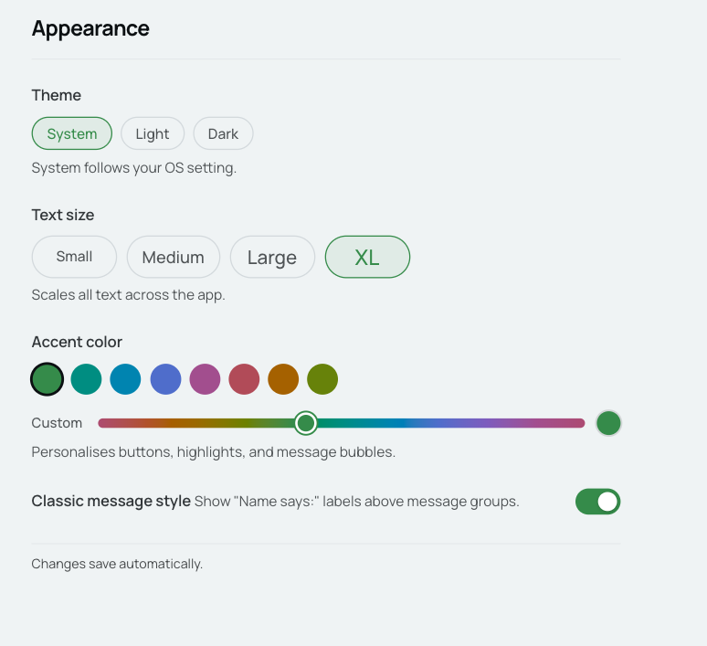
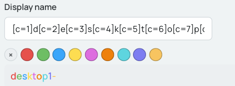
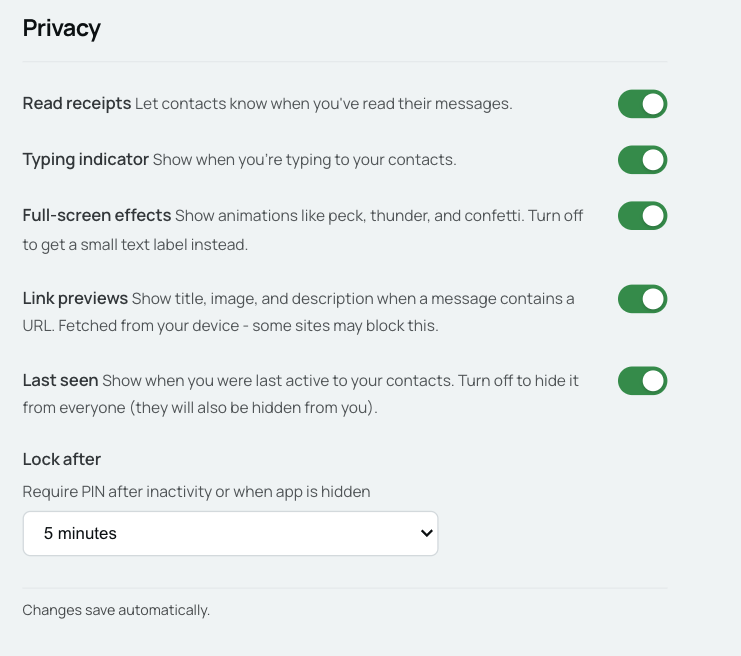
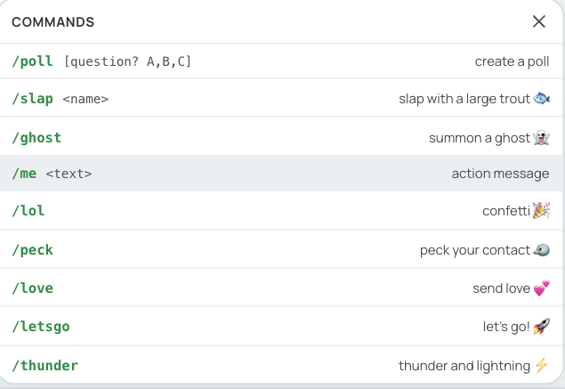

# Welcome to Starling 

This is Starling a free chat app that currently runs in your browser to-do: 
- Native Apps for Windows/Mac/Android
- Native App for IOS
- Stickers
- custom emojis 
- custom stickers


## Functions: 
- Set a custom name, notification name and status ( old school MSN names possible: `[-+-_ William _-+-]`)
- Send eachother a gif a poke (msn style buzz) or a few other commands
- Polls
- Markdown formatting
- Status
- Your own private message server if you want it
- Use of the Starling server if you dont want to host one yourself (WIP)
- Your PIN is your ID no email, no phone just a server and a pin
- Custom backgrounds and a few other appearance settings:

    
- Colors in your diplay name (smileys also possible):

    
- Share your contact details trough QR code
- Starring messages
- Replying to messages with swipe.
- archive chat
- edit/delete messages
- group chats
- profile photos
- broadcasting privatly or in group.
- file (5mb limit at the moment, if self hosted this could be larger) /photo sharing (compressed / uncompressed)
- Basic privacy settings: 

    

## Untested Functions:
- Calling
- Video Caling
- Screen sharing
- scanning qr code to add friend. 
- Join multiple colonies and switch between them:


## Commands
You can also use IRC style commands:




# Run the client
`cd ./client && npm run tauri dev`

# Run the server
put this behind a reverse proxy: 
`docker compose up -d --build` 

example:
```
server {
    listen 80;
        server_name messages.example.com;
        location / { return 301 https://messages.example.com§$request_uri; }
    }

    server {
        listen 443 ssl;
        ssl_certificate     /etc/nginx/certs/cert.pem;
        ssl_certificate_key /etc/nginx/certs/privkey.pem;
        server_name messages.example.com;

        location / {
        proxy_pass         http://192.168.10.15:3001;
        proxy_http_version 1.1;
        proxy_set_header   Upgrade    $http_upgrade;
        proxy_set_header   Connection "upgrade";
        proxy_set_header   Host       $host;
        proxy_set_header   X-Real-IP  $remote_addr;
    }
}
```
